# Image Denoising Using Generative Adversarial Networks
### Samuel Rocco, Indiana University of Pennsylvania, U-SOAR

This repository contains the code and resources for a research project conducted under the U-SOAR program at Indiana University of Pennsylvania. The project utilizes Generative Adversarial Networks (GANs) to denoise images with varying levels of noise. 

## Project Overview

Generative Adversarial Networks (GANs) have gained significant attention for their ability to generate realistic data. In this project, we explore their application in image denoising. We trained a GAN to remove noise from images, enhancing their clarity and quality.

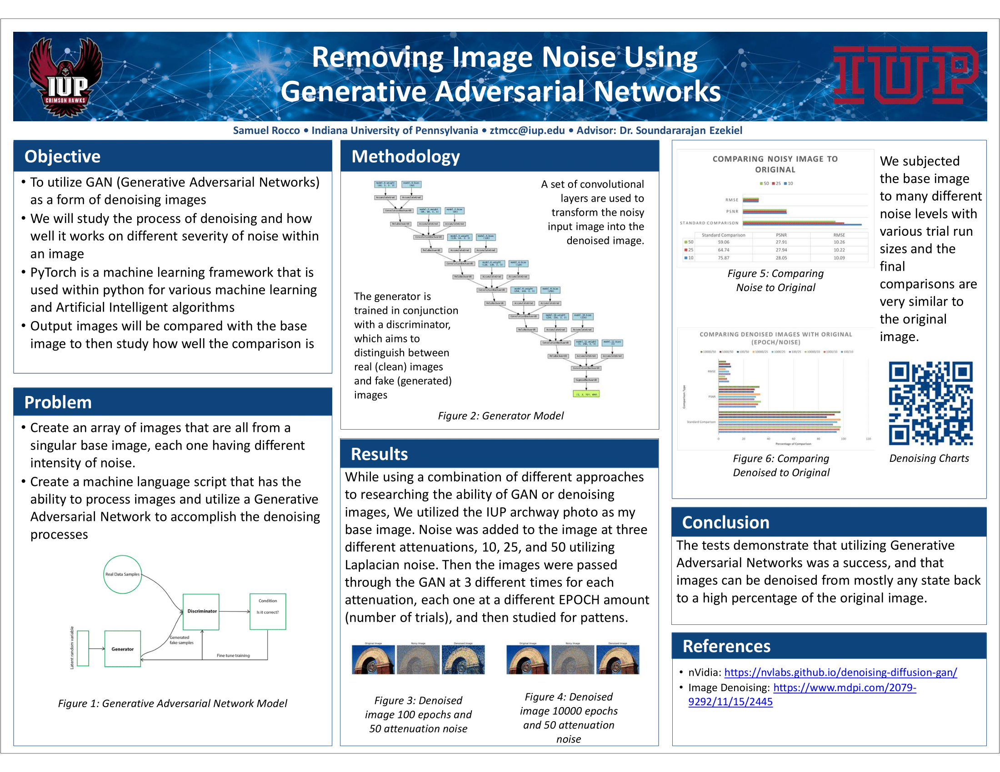

The network model used to generate clearer images based on the previous image:

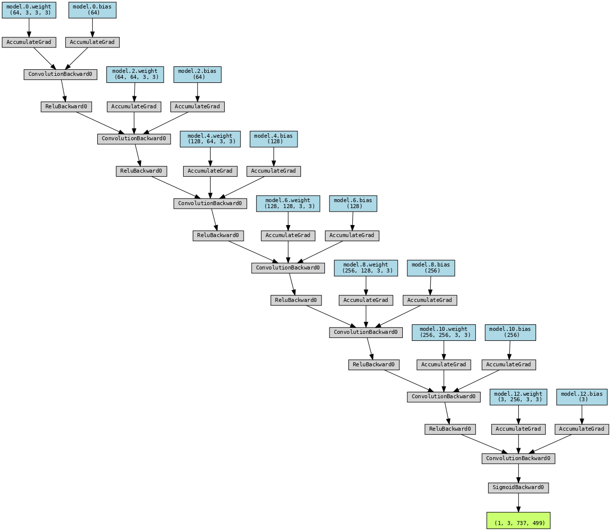

## Generative Adversarial Network architecture diagram:


## Repository Contents

- `GAN.py`: Script for training the GAN to denoise images.
- `Img_compare.py`: Script for comparing images before and after denoising.
- `Img_compare_PSNR.py`: Script for calculating the Peak Signal-to-Noise Ratio (PSNR) to evaluate the denoising performance.
- `Img_compare_RMSE.py`: Script for calculating the Root Mean Squared Error (RMSE) and PSNR for denoised images.
- `Noise_Test.py`: Script for adding noise to images.
- `ComparisonPDF.pdf`: Contains a detailed comparison of the results of the denoising process.

## Usage

### Training the GAN

Use the `GAN.py` script to train the GAN to denoise images. The script takes noisy images as input and outputs denoised images.

```bash
python GAN.py
```

### Adding Noise to Images

Use the `Noise_Test.py` script to add noise to images. You can specify the noise level within the script.

```bash
python Noise_Test.py
```

### Image Comparison

Use the `Img_compare.py` script to compare original noisy images with denoised images.

```bash
python Img_compare.py
```

### PSNR Calculation

Use the `Img_compare_PSNR.py` script to calculate the PSNR of the denoised images.

```bash
python Img_compare_PSNR.py
```

### RMSE and PSNR Calculation

Use the `Img_compare_RMSE.py` script to calculate both the RMSE and PSNR of the denoised images.

```bash
python Img_compare_RMSE.py
```

## Results

The following images and charts illustrate the results of the denoising process at different levels of noise and epochs.

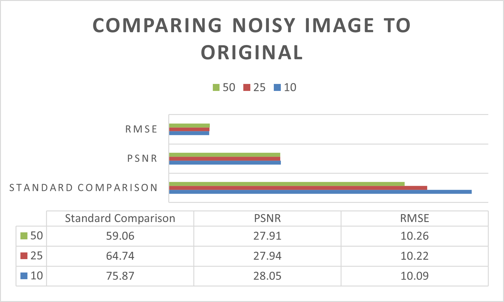 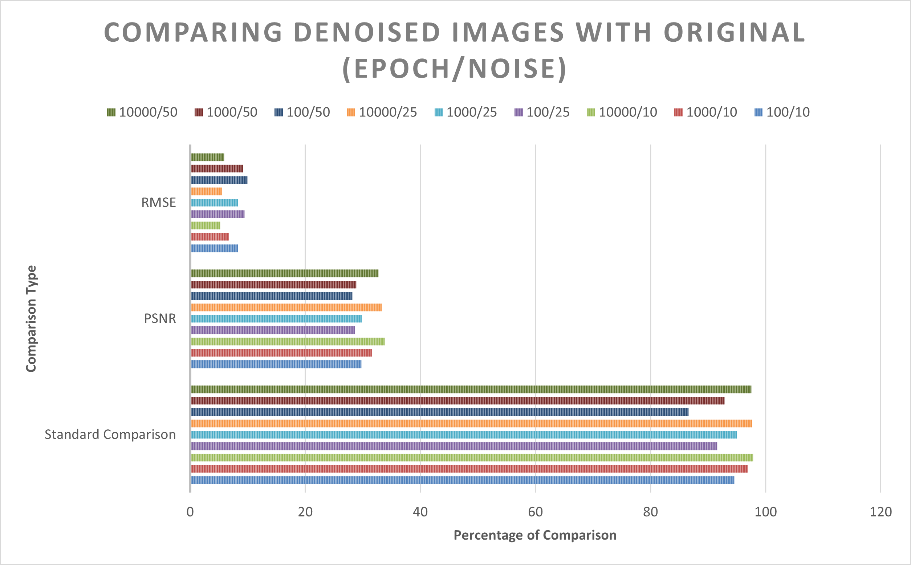

### Epoch 100

- **Noisiness 10**
  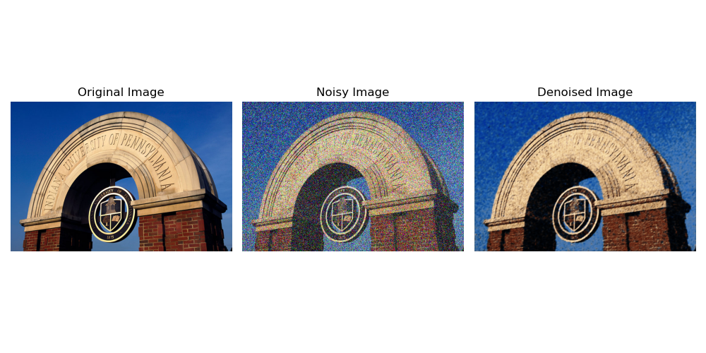

- **Noisiness 25**
  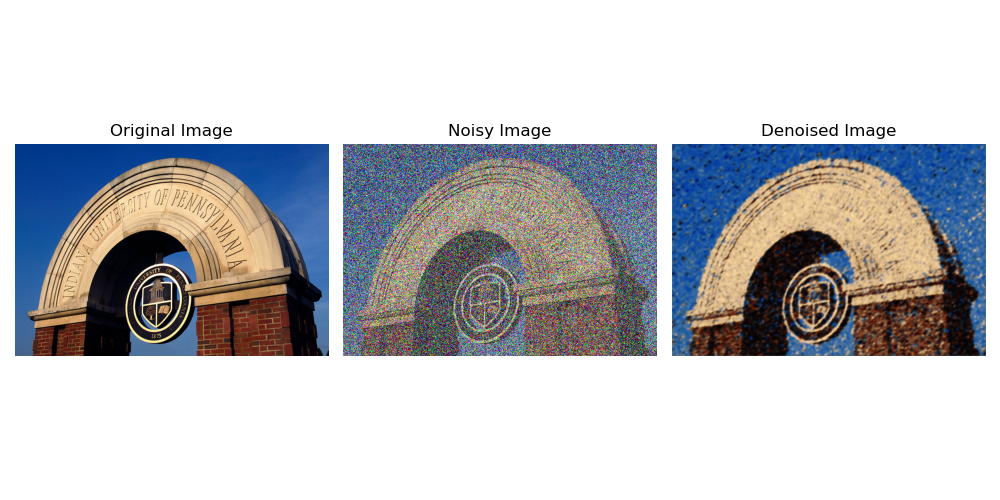

- **Noisiness 50**
  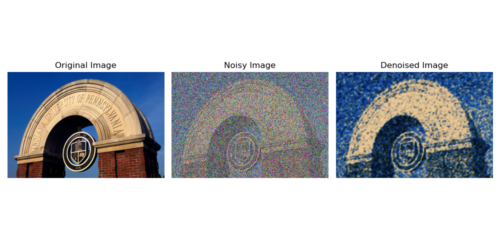

### Epoch 1000

- **Noisiness 10**
  

- **Noisiness 25**
  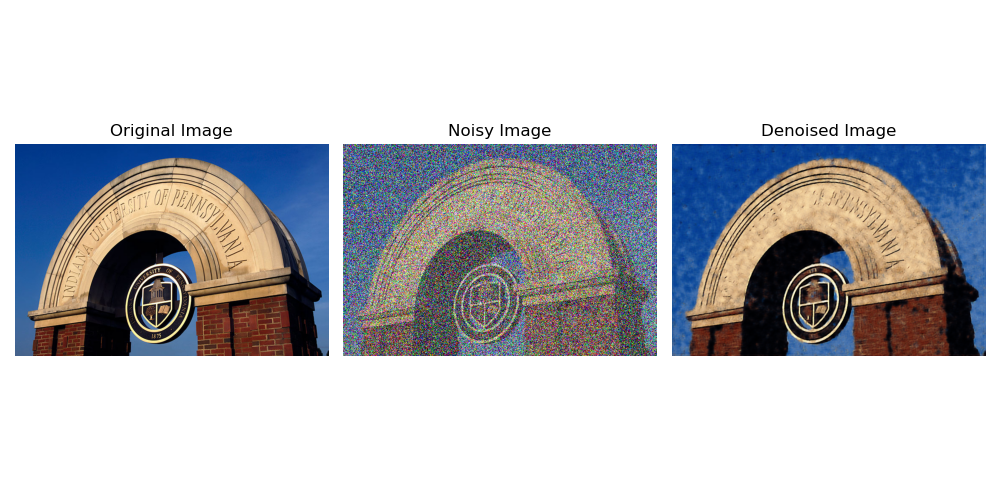

- **Noisiness 50**
  

### Epoch 10000

- **Noisiness 10**
  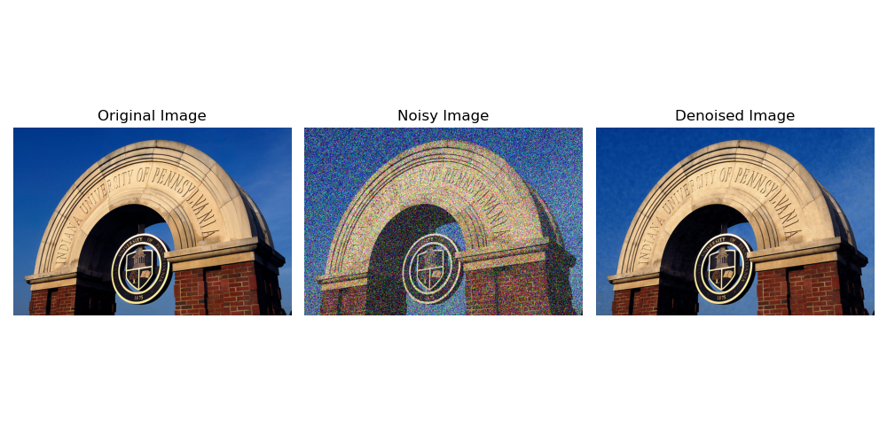

- **Noisiness 25**
  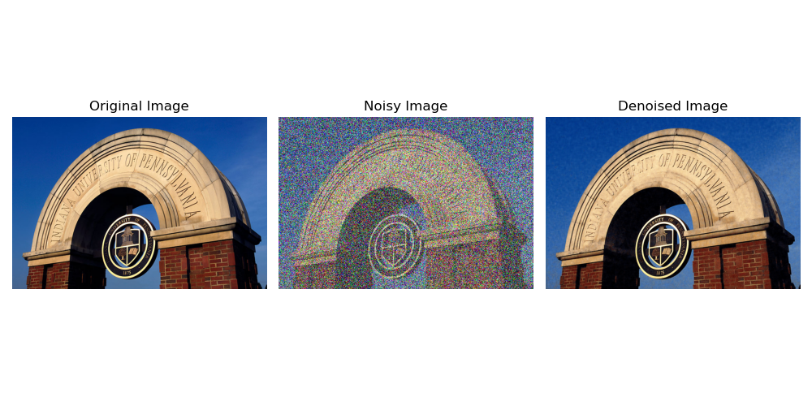

- **Noisiness 50**
  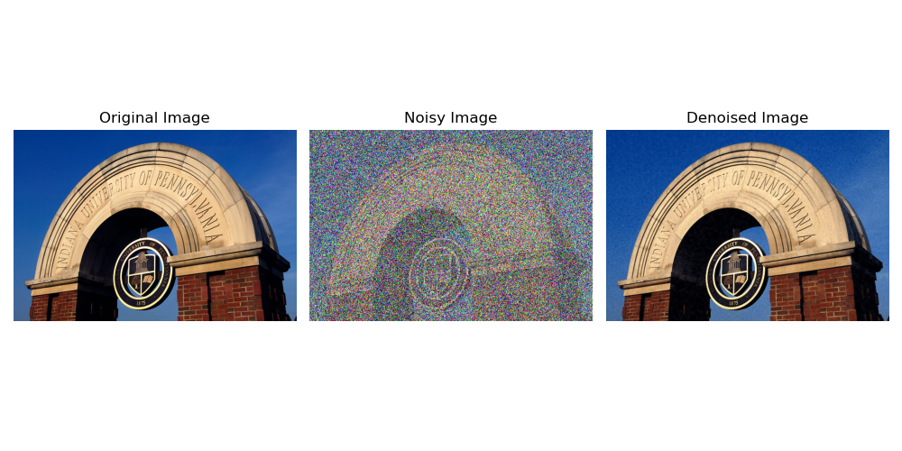

## License

This project is licensed under the MIT License - see the [LICENSE](LICENSE.txt) file for details.
